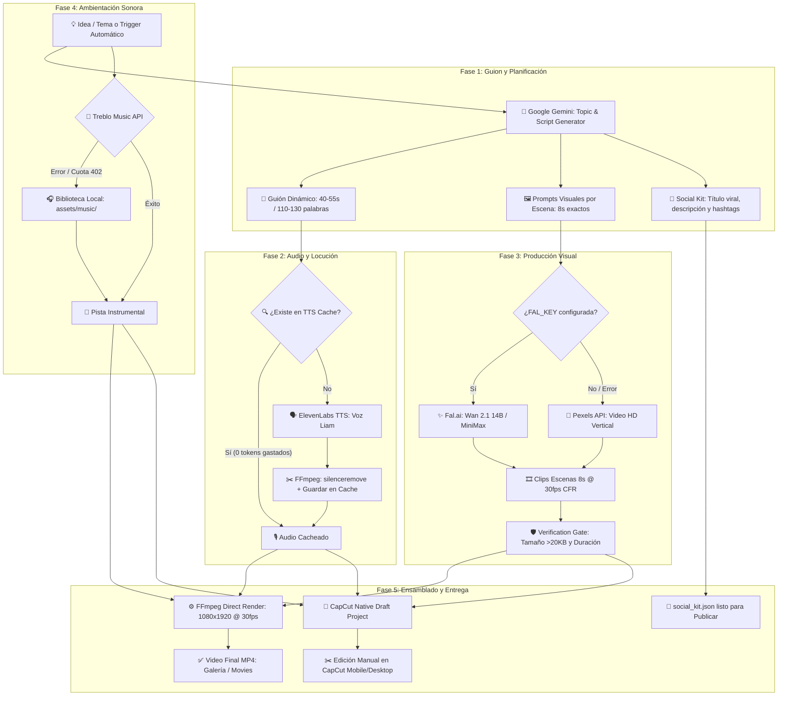

# 🎬 Video_Auto_Agent

[](LICENSE)
[](https://python.org)
[-orange.svg)]()
[](https://modelcontextprotocol.io/)

**Video_Auto_Agent** es una suite de automatización completa para la producción integral de videos verticales (9:16) optimizados para **TikTok, YouTube Shorts e Instagram Reels**. 

Combina modelos de lenguaje de última generación (**Google Gemini**), síntesis de voz hiperrealista (**ElevenLabs**), generación visual mediante IA (**Fal.ai Wan 2.1 / MiniMax Hailuo**) con fallback inteligente a videos reales (**Pexels API**), y post-producción dual mediante **FFmpeg** y proyectos nativos de **CapCut**.

Todo el sistema está optimizado con bajo consumo de memoria y CPU, preparado para ejecutarse sin problemas tanto en servidores como localmente en dispositivos móviles Android vía **Termux**.

---

## 🏗️ Diagrama de Arquitectura y Flujo



---

## 🌟 Características Principales

- **Generación Integral de Contenido**: Redacción de guiones con ganchos virales (hooks), retención de audiencia y llamadas a la acción (CTA) con control exacto de duración (40 a 55 segundos).
- **Voz Hiperrealista (ElevenLabs)**: Configurado con la voz enérgica *Liam*, volumen calibrado al 100% y recorte automático de silencios muertos mediante filtros FFmpeg.
- **Protección de Tokens (TTS Cache)**: Sistema de almacenamiento en caché basado en hashes SHA-256 del texto para evitar llamadas redundantes a ElevenLabs y proteger tus créditos de API.
- **Video con IA Multicapa**:
  1. **Fal.ai**: Generación de video con modelos *Wan 2.1 (14B / 1.3B)* y *MiniMax Hailuo*.
  2. **Pexels Stock Video (Fallback Inteligente)**: Si no hay clave de IA o se agotan los créditos, descarga clips verticales reales de 720p/1080p con loop continuo (`-stream_loop -1`) sin congelamiento de fotogramas.
  3. **Verification Gate**: Cada clip es analizado antes de la unión para garantizar integridad de datos y evitar fallos de renderizado.
- **Mezcla Sonora Calibrada**: Voz clara al 100% (`1.0`) y música ambiental instrumental al 15% (`0.15`), garantizando inteligibilidad perfecta.
- **Doble Salida**:
  - **Render Directo FFmpeg**: Producción instantánea a 30fps CFR, H.264 + AAC, listo para subir a redes.
  - **Borrador Nativo de CapCut**: Estructura JSON compatible con CapCut para retocar efectos, transiciones o subtítulos automáticos.
- **Kit para Redes Sociales**: Genera automáticamente títulos clickeables, descripciones optimizadas para SEO y etiquetas (#hashtags) listas para copiar y pegar.
- **Soporte Protocolo MCP**: Expone todas las funcionalidades como herramientas compatibles con agentes de inteligencia artificial y el CLI Antigravity (`agy`).

---

## 🛠️ Herramientas MCP (`video_mcp_server.py`)

| Herramienta | Parámetros Clave | Descripción |
| :--- | :--- | :--- |
| `generate_voiceover_elevenlabs` | `text`, `output_path`, `voice_id` | Genera locución con ElevenLabs, elimina pausas largas y gestiona caché SHA-256. |
| `generate_cinematic_scene_clip` | `prompt`, `output_path`, `duration_sec`, `scene_index` | Genera clips con IA (Fal.ai) o descarga stock de Pexels con normalización a 1080x1920. |
| `generate_ambient_music_treblo` | `prompt`, `output_path`, `duration_sec` | Genera pistas instrumentales mediante IA (con fallback automático a `assets/music/`). |
| `create_capcut_draft_project` | `project_name`, `video_paths`, `voiceover_path`, `music_path` | Genera el proyecto nativo editable para CapCut con los niveles de volumen requeridos. |
| `render_instant_video_ffmpeg` | `video_paths`, `voiceover_path`, `music_path`, `output_path` | Renderiza el video final uniendo escenas mediante filtros complejos FFmpeg a 30fps. |
| `generate_script_with_gemini` | `topic`, `target_duration_sec` | Redacta el guion narrativo y los prompts de video por escena sincronizados en tiempo. |
| `generate_social_kit_with_gemini`| `script_text`, `topic` | Crea títulos llamativos, descripciones y hashtags relevantes para redes. |

---

## 🚀 Instalación y Requisitos

### 1. Requisitos del Sistema
- **Python 3.10 o superior**
- **FFmpeg & ffprobe**
- **curl**

#### En Linux / Ubuntu / Debian:
```bash
sudo apt update && sudo apt install -y python3 python3-pip ffmpeg curl
```

#### En Termux (Android):
```bash
pkg update -y
pkg install -y python python-pip ffmpeg curl
termux-setup-storage
```

### 2. Clonar el Repositorio e Instalar Dependencias
```bash
git clone https://github.com/mrgab0/Video_Auto_Agent.git
cd Video_Auto_Agent
pip install requests python-dotenv mcp google-genai
```

---

## ⚙️ Configuración (`.env`)

Crea un archivo `.env` en la raíz del proyecto tomando como referencia `.env.example`:

```bash
cp .env.example .env
```

Edita `.env` con tus credenciales:

```env
# Google Gemini (Generación de Guiones, Prompts y Social Kit)
GEMINI_API_KEY="tu_clave_de_gemini"

# ElevenLabs (Locución y Voz en Off)
ELEVENLABS_API_KEY="tu_clave_de_elevenlabs"
ELEVENLABS_VOICE_ID="TX3LPaxmHKxFdv7VOQHJ"  # Voz 'Liam' por defecto

# Pexels API (Stock Videos HD Verticales - Fallback)
PEXELS_API_KEY="tu_clave_de_pexels"

# Fal.ai (Videos Generados por IA - Wan 2.1 / MiniMax)
FAL_KEY="tu_clave_de_fal_ai"

# Treblo API (Música Instrumental - Opcional)
TREBLO_API_KEY="tu_clave_de_treblo"
```

---

## 💻 Uso

### Modo Autónomo Completo
Para generar un video completo de principio a fin (guion, locución, clips, música, render FFmpeg y borrador de CapCut):

```bash
python3 pipeline_runner.py --topic "El mayor misterio de la Deep Web"
```

Si no especificas `--topic`, Gemini seleccionará automáticamente un tema intrigante evitando temas utilizados previamente según el historial local.

### Opciones de Ejecución

```bash
# Simulación rápida sin consumir créditos de API (Dry Run)
python3 pipeline_runner.py --topic "Inteligencia Artificial" --dry-run

# Forzar sobreescritura ignorando caché previo
python3 pipeline_runner.py --topic "Espacio profundo" --force

# Limpiar archivos temporales al terminar
python3 pipeline_runner.py --topic "Misterios arqueológicos" --cleanup
```

### Salidas Generadas
- **Video Renderizado**: `output/<nombre_proyecto>/final_video.mp4`
- **Kit para Redes**: `output/<nombre_proyecto>/social_kit.json`
- **Proyecto CapCut**: `capcut_drafts/<nombre_proyecto>/draft_content.json`
- **Copia móvil automática**: Si se ejecuta en Android, el video final se copia directamente a `/sdcard/Movies/` para visualización inmediata en la galería.

---

## 📄 Licencia

Distribuido bajo la Licencia MIT. Consulta `LICENSE` para más información.
